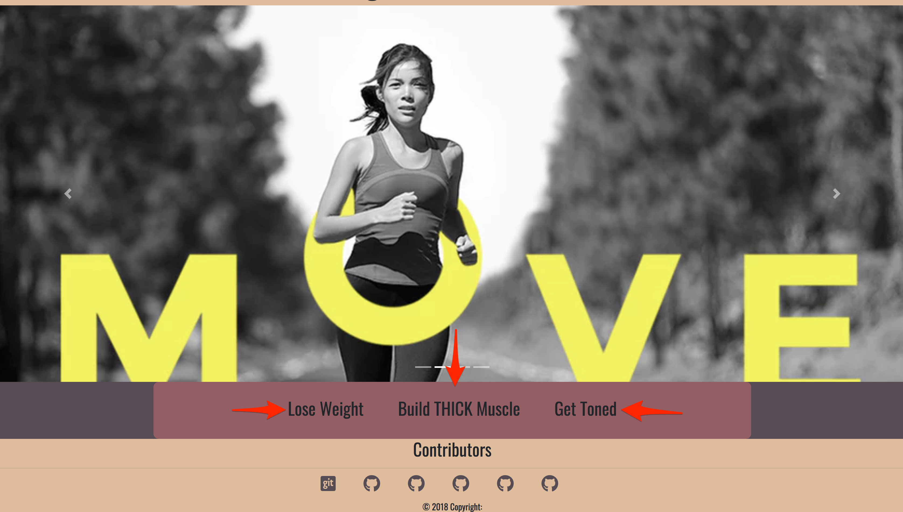
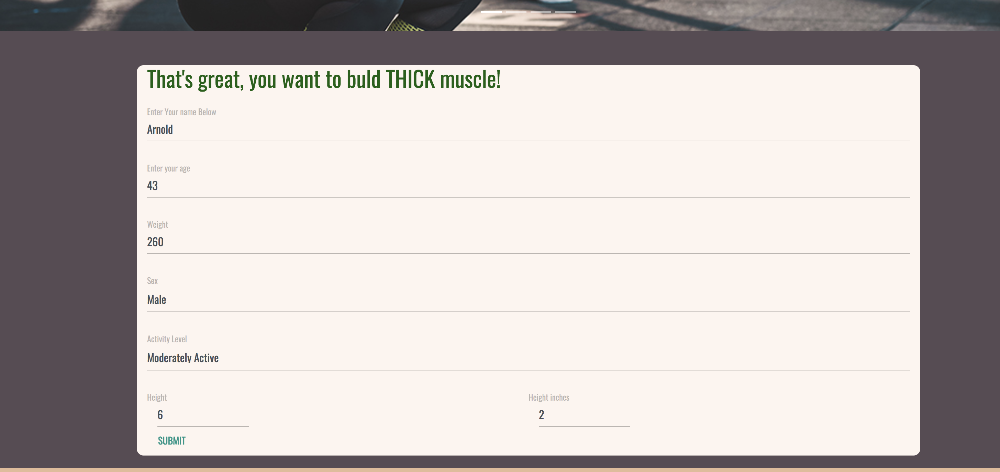
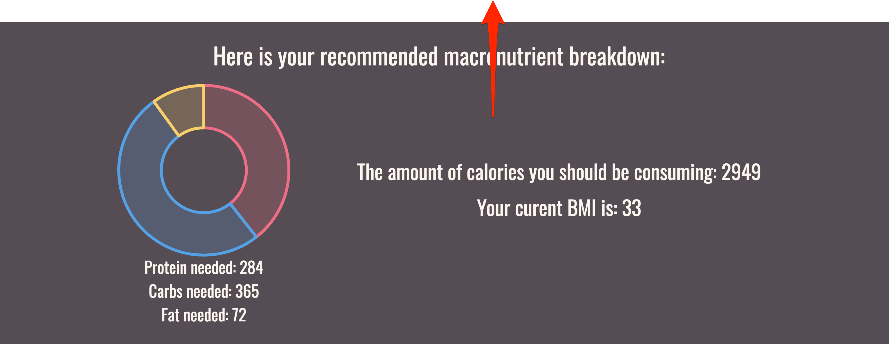
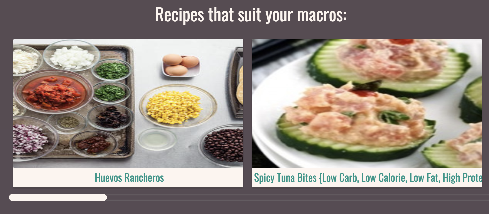

# Project Title: Work in Progress: Your body, Your life.

This application was developed by: Brogan Stich, Delphine Urubera, Grace Houghton Andrizzi, Grant Kourey, and Peter MacDonnell

Work in Progress: Your body, Your life is an application designed to provide a pathway for users to achieve their fitness goals. We do this by allowing the user to input information about themselves. We assess their current fitness needs and provide  a tailored path to reach their goals.  

## Technologies Used: 

APIS:
	* Youtube API: to provide fitness videos tailored to your goals. *Edamam API: nutritional database to provide custom recipe
	
CDN:
	*Chart.js
	*Material Bootstrap by design
	*Font Awesome
	*Popper.js
	*Google Fonts
	*Jquery
	*Specialty Verbal: David, V, Ray, and Dani. 
	

## Getting Started

All you need to enjoy our web application is a computer, browser, and to know basic facts about yourself such as height, weight, age, and sex.

## Process: 
* Upon page load, user selects fitness goal

* User inputs personal information onto form: 

* The App returns your resting metabolic rate and Macronutrients

* The App returns custom fitness videos

* The App returns custom recipes

## Challenges
* Material Bootstrap was a challenge to work with. The built in styling was difficult to understand.  Writing over certain inherit styling proved to be difficult during the process. 

* Using the front-end to try to access a back end data-server was difficult.  We needed to use a thrid party to be able to accomplish this. 

## Future Developments:

* Integrating google maps to provide gyms, hikes, etc.
* Allow data persistence to have users progress tracked over time. (create account, etc.)
* Integrating the entire Edamam database to utilize personal recipes.
* Have suggestions to eat based on what you have in your fridge and how many macrosnutrient you have left. 

## Authors

**Brogan Stich** - 
https://github.com/ad-victoriam-101

**Delphine Urubera** -
https://github.com/delphine18

**Grace Houghton Andrizzi** -
https://github.com/adorkwithaspork

**Grant Kourey** -
https://github.com/gmkourey

**Peter MacDonnell** -
https://github.com/PeterMacDonnell

## License

This project is licensed under the MIT License - see the [LICENSE.md](LICENSE.md) file for details

## Acknowledgments

Hat tip to:
* David Hallinan
* Vaibhav Tank
* Dani Gellis
* Ray